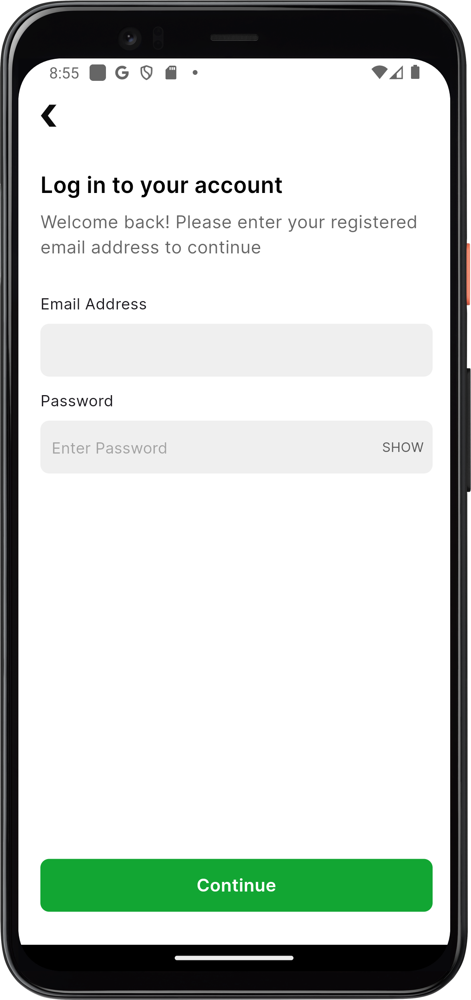
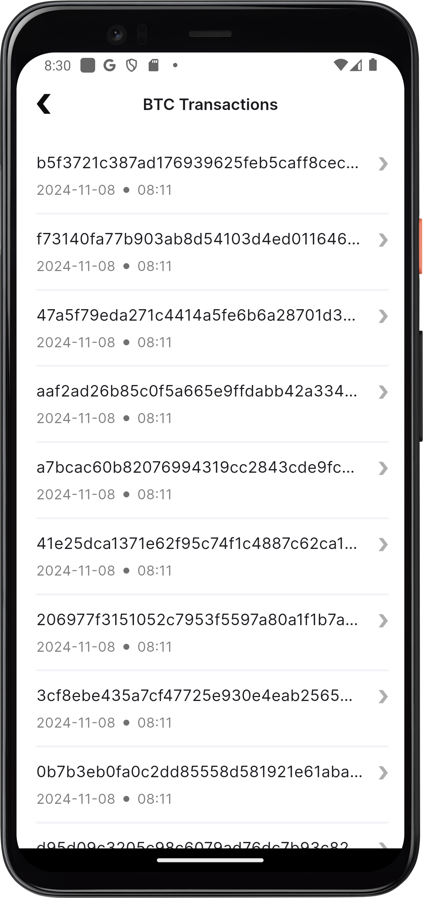
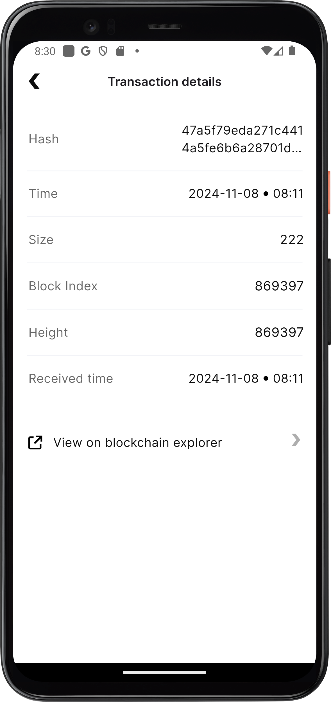

# busha_app

## Getting Started

After cloning,

### Generate code files by running the following command.

```bash
flutter pub get
flutter pub run build_runner build
```

## Link to an Android apk
--- https://drive.google.com/file/d/1NtBUav8Ew3kmMpWX5mH1oHALTh2YBQy9/view?usp=sharing


 The login screen does not make any network calls to verify a user's authenticity, 
 it just verifies that the inputted email is a valid email address and the password 
 inputted matches certain criteria

## Screenshots
<div style="text-align: center">
  <table>
    <tr>
      <td style="text-align: center">
        
      </td>
      <td style="text-align: center">
        
      </td>
      <td style="text-align: center">
        
      </td>
    </tr>

   <tr>
      <td style="text-align: center">
        
      </td>
    </tr>
  </table>
</div>

## License

MIT License

